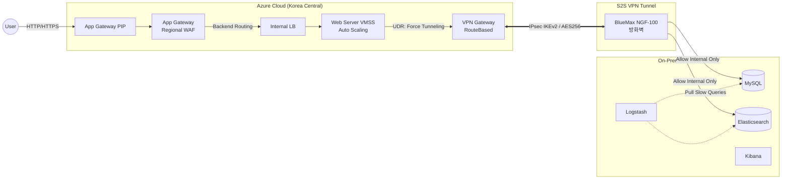

# Hybrid Cloud Architecture
> **프로젝트 목표:** 퍼블릭 클라우드(Azure)의 유연성과 온프레미스의 보안 통제력을 결합한 하이브리드 인프라 구축

## 1. 프로젝트 개요
단순한 클라우드 마이그레이션을 넘어, 물리 인프라(On-premise)의 보안성과 퍼블릭 클라우드(Azure)의 확장성을 동시에 충족하는 하이브리드 클라우드 시스템을 IaC(Terraform)로 구현함.

웹 서비스(WordPress) 프론트엔드는 클라우드(VMSS)에 배치하여 트래픽 변화에 탄력적으로 대응하고, 보안이 중요한 핵심 데이터(MySQL, Elasticsearch)는 온프레미스 사설망에 격리하여 기업 데이터 주권을 확보함. 허브-스포크(Hub-Spoke) 네트워크 구조와 Site-to-Site VPN을 기반으로 모든 통신을 중앙에서 통제하는 제로 트러스트(Zero Trust) 보안 전략을 적용함.

---

## 2. 아키텍처 구성도
외부 사용자는 Azure DMZ 영역의 WAF를 거쳐 클라우드 웹 서버에 접속하며, 웹 서버는 S2S VPN 터널과 온프레미스 물리 방화벽(BlueMax NGF-100)을 통과해야만 내부 DB에 접근할 수 있는 심층 방어 구조.

---

## 3. 핵심 기술 및 구현 논리

* **온프레미스 보안 및 통합 관제 (On-Premise Security & Observability)**
    * **물리 방화벽(BlueMax NGF-100) 기반 경계 보안:** 클라우드로부터 유입되는 SQL 질의 패킷을 실시간 탐지하고, 인가된 Azure 내부망 IP 대역만 선별적으로 허용(Allow)하여 데이터베이스 접근을 엄격히 통제함.
    * **ELK Stack을 활용한 하이브리드 모니터링:** Logstash를 구성하여 온프레미스 MySQL의 슬로우 쿼리 및 에러 로그를 수집하고, Elasticsearch에 적재. Kibana 대시보드에서 하이브리드 환경의 트래픽 패턴과 장애 로그를 단일 뷰(Single Pane of Glass)로 시각화함.
* **하이브리드 네트워크 연동 (Site-to-Site VPN)**
    * **사설망 수준의 보안 연결:** 공용 인터넷을 통과하지만 IPsec VPN(IKEv2)을 통해 전 구간 암호화 통신 수행. 이기종 장비 간 호환성을 위해 Terraform 코드 내에 IPsec 정책(AES256, SHA256 등)을 명시적으로 선언함.
    * **게이트웨이 전송 (Gateway Transit):** VNet Peering 시 `allow_gateway_transit` 옵션을 활성화하여, Spoke(App) 네트워크가 Hub의 VPN 게이트웨이를 공유하도록 구성함.
* **제로 트러스트 및 강제 라우팅 (Force Tunneling)**
    * **아웃바운드 트래픽 통제:** UDR(사용자 정의 경로)을 구성하여 App 서브넷에서 온프레미스 DB(192.168.20.0/24)로 향하는 패킷이 반드시 Hub의 VPN 게이트웨이를 경유하도록 강제 라우팅함.

---

## 4. 기술 스택

| 분류 | 기술 스택 | 적용 목적 및 활용 |
|:---:|:---|:---|
| **IaC** |  | Policy, Hub, App, DMZ 등 모듈 기반 인프라 코드화 배포 |
| **Regional LB** |  | 외부 진입점 역할 및 2차 방어(WAF) 수행 |
| **Compute** |   | Rocky Linux 기반 웹 서버 오토스케일링 클러스터 |
| **Database** |  | 온프레미스 내부에 격리 배치하여 핵심 데이터 주권 보호 |
| **Observability** |    | 통합 로그 수집 및 하이브리드 인프라 실시간 가시성 확보 |
| **Security** |   | 온프레미스 진입점 물리 방화벽(NGF-100) 및 Azure 서브넷 L3/L4 제어 |

---

## 5. 설계 의도 (Architecture Design Intent)

* **클라우드 웹 서버와 온프레미스 DB의 분리 배치**
    * 클라우드의 확장성은 누리되 핵심 데이터(포스팅 및 사용자 정보)의 외부 유출 위험을 원천 차단하기 위함. 이를 위해 데이터는 물리적 통제망(On-Premise) 내 MySQL에 안전하게 저장하고, 웹 프론트엔드만 클라우드(VMSS)에 배치하여 트래픽 부하를 분산함.
* **모듈 간 의존성 최소화를 위한 네트워크 대역(CIDR) 주입**
    * 여러 모듈(Hub, App, DMZ)이 서로를 참조할 때 발생하는 의존성 오류(Circular Dependency)를 방지하기 위해, Root 모듈의 `locals`에서 네트워크 대역을 사전 계산하고 하위 모듈에 변수로 주입(Injection)하는 아키텍처를 채택함.

---

## 6. Technical Challenges & Troubleshooting

**① 물리 방화벽(BlueMax NGF-100)의 상태 꼬임 및 VPN 터널링 연결 실패**
* **문제:** Azure VPN Gateway(RouteBased)와 온프레미스 방화벽(BlueMax NGF-100) 간의 IPsec 정책(AES256, SHA256, DHGroup2 등) 및 공유 키(Shared Key) 설정이 완벽히 일치함에도 불구하고 VPN 연결이 지속적으로 실패함.
* **해결:** 클라우드 측의 논리적인 설정 값에는 오류가 없음을 검증하고, 레거시 물리 장비 특유의 '상태 꼬임(State Lock)' 현상을 원인으로 지목함. 온프레미스 방화벽의 VPN 관련 설정을 전면 초기화하고 처음부터 다시 세팅하는 방식을 택함. 이후 정상적으로 VPN 터널링을 성공시킴. 예측 불가한 물리 장비의 변수 앞에서는 논리적 디버깅보다 '초기화 후 재구성'이 가장 빠르고 정확한 트러블슈팅이 될 수 있다는 실무적 감각을 획득함.

**② 물리 장비 결함으로 인한 병목 현상과 IaC를 활용한 위기 돌파**
* **문제:** 온프레미스 라우터 및 스위치의 하드웨어 결함이 발생하여 이를 분리하고 네트워크를 재구성하는 작업이 지연됨. 이로 인해 하이브리드 연동의 핵심인 Azure 측 클라우드 인프라 구축 일정이 전면 중단되었고, 프로젝트 기한이 극도로 촉박해짐.
* **해결:** 기존 '다중 리전 DR 인프라' 프로젝트 진행 시 작성해둔 Terraform 모듈(Policy, Hub, App, DMZ)을 적극 재활용함. 하이브리드 아키텍처 요구사항에 맞춰 로컬 변수(CIDR, VPN Policy 등)와 라우팅 테이블(UDR)만 신속하게 수정하여 즉시 프로비저닝함. 결과적으로 며칠이 소요될 클라우드 구축 작업을 단시간에 완료하며, 코드로 통제되는 인프라(IaC)의 높은 재사용성과 효율성을 입증함.

**③ Event Hub와 Logstash 연동 시 기본 인증서(TLS/SSL) 검증 충돌**
* **문제:** Azure 인프라 모니터링을 위해 Event Hub에서 발생한 로그를 온프레미스의 Logstash로 가져오는 파이프라인을 구축함. 이 과정에서 Logstash의 기본 인증서 검증 로직과 보안 프로토콜 설정이 충돌하여 Handshake 에러 및 로그 수신 거부 현상이 발생함.
* **해결:** 프로젝트 마감 기한을 고려하여 복잡한 커스텀 인증서 발급 대신, Logstash Input 플러그인 설정에서 Event Hub 연결 시 엄격한 SSL 인증서 검증(Verification) 단계를 비활성화(Disable)하도록 구성함. 이를 통해 인증서 충돌 문제를 신속하게 우회하고 정상적인 로그 파이프라인 적재를 완료함.

---

## 7. 프로젝트 한계점 및 개선 방향 (Limitations)

비용 및 일정 제약으로 인해 발생한 아키텍처 한계점과, 실제 상용(Production) 환경 도입 시 요구되는 보완 사항을 다음과 같이 정리함.

* **네트워크 단일 장애점(SPOF) 존재**
    * **현황:** 클라우드 비용 절감을 위해 VPN Gateway를 단일 구성(`active_active = false`)으로 배포함. 게이트웨이 장애 시 하이브리드 통신이 전면 단절되는 아키텍처적 한계 존재.
    * **개선:** 데이터 트래픽 증가에 따른 병목 현상 방지 및 안정적인 서비스 연속성(HA) 확보를 위해, BGP 동적 라우팅 기반의 Active-Active VPN 구성 또는 대용량 전용선(Azure ExpressRoute) 연동 구조로 전환 필요.
* **Terraform State 관리의 한계**
    * **현황:** 소규모 팀 프로젝트 특성상 Terraform State 파일을 로컬 환경에서 관리함.
    * **개선:** 실무 환경에서 다수 엔지니어 협업 시 동시 작업으로 인한 설정 충돌을 방지하기 위해, Azure Storage Account 기반의 Remote Backend 구축 및 State Lock 적용 필요.
* **수동 프로비저닝에 따른 운영 리스크**
    * **현황:** 인프라 형상 변경 시 로컬 환경에서 CLI 기반 수동 배포(`terraform apply`) 수행.
    * **개선:** 휴먼 에러를 방지하고 체계적인 인프라 형상 관리를 유지하기 위해, GitHub Actions 등을 활용한 IaC 자동 검증(Plan) 및 배포(Apply) 파이프라인(CI/CD) 구축 필요.
